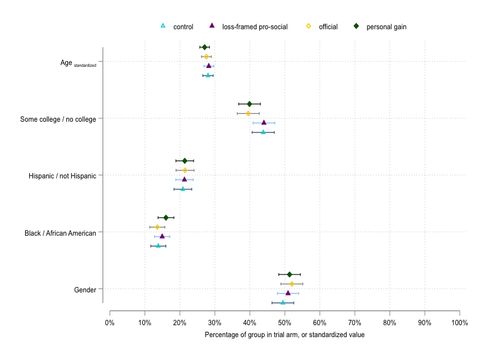

# balance-plot
Stata programme for making simple balance plots with experimental data

I regularly run randomized controlled trials, and found myself writing/copying lots of code everytime I wanted a simple balance plot with means +/- 95% confidence intervals for covariates by trial arm. So I made balance_plots.ado. It is not a complex programme, and can no doubt be extended in a number of interesting ways. It was originally made for binary variables only, but i've since extended it to work with continuous variables too by standardizing them on a 100 scale. 

The graphs look something like this:

